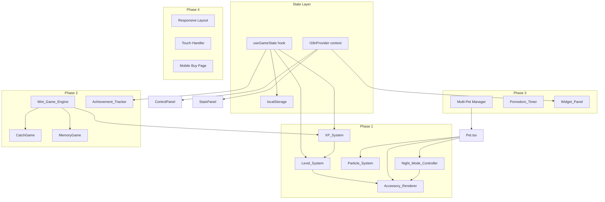

# Design Document: Gameplay Visual Upgrade

## Overview

This design extends PixelPets — a React + TanStack Start + Electron desktop pet app with 52 SVG pixel art pets — with four incremental phases of gameplay, visual, utility, and accessibility features. Each phase is independently deployable.

The existing architecture centers on:
- `Pet.tsx`: stateful component managing position, stats (hunger/happiness/energy), movement, drag, speech bubbles, and system awareness reactions
- `petSprites.tsx`: SVG-based rendering with `PetDef.render(facing, step)` returning ReactNode
- `ControlPanel.tsx` + `StatsPanel.tsx`: UI panels for pet selection, cursor selection, stats display, and actions (feed/play/sleep)
- `useSystemAwareness.ts`: hook providing battery, idle, time-of-day, and visibility data
- `audio.ts`: WebAudio synthesizer with `playSound(name)` — no external files
- Electron: two-window architecture (panel + transparent pet overlay) communicating via IPC through `preload.cjs`
- Web demo: TanStack Start on Cloudflare Workers at `/` route
- All state persisted in `localStorage`
- Tailwind CSS 4 with custom dark gaming theme (neon green/pink/cyan)

**Phase summary:**
1. XP system, level progression, equippable SVG accessories, particle effects, automatic night mode
2. Mini-games (catch game, memory game), achievement system
3. Multiple simultaneous pets with interactions, pomodoro timer, desktop widgets
4. i18n (English + Portuguese), responsive mobile layout, touch interactions

## Architecture

### High-Level Component Hierarchy



### State Management Strategy

All new game state flows through a single `useGameState` custom hook that wraps localStorage reads/writes with React state. This avoids introducing a state management library while keeping the pattern consistent with the existing `useSystemAwareness` approach.

```
useGameState() → {
  xp, level, accessories, achievements, pomodoroState, locale,
  addXp(), equipAccessory(), unlockAchievement(), ...
}
```

The hook reads from localStorage on mount and writes on every mutation. For Electron, the panel window reads game state from localStorage (shared same-origin), and IPC messages carry only transient events (pet actions, stats updates) — not persistent state.

### Rendering Strategy

All visual additions use SVG, consistent with the existing sprite system:
- **Accessories**: SVG `<g>` elements layered on top of the pet sprite inside the same `<svg>` viewBox
- **Particles**: Absolutely-positioned `<svg>` elements within the pet container div, removed after animation via `onAnimationEnd`
- **Mini-games**: Overlay `<div>` with SVG/emoji elements, positioned within the pet viewport area
- **Widgets**: Standard React components using the existing `glass` CSS utility class

### Electron Integration

New IPC messages extend the existing `preload.cjs` bridge:
- `pet-level-up`: pet overlay → main → panel (triggers level-up display in stats panel)
- `pet-accessory`: panel → main → pet overlay (equip/unequip accessory)
- `mini-game-start` / `mini-game-end`: panel → main → pet overlay (pause pet movement during games)
- `pomodoro-tick`: shared timer state between windows

The pet overlay window remains transparent and click-through except when mouse is over a pet element (existing hit-test logic). Mini-games run in the panel window, not the overlay.

## Components and Interfaces

### Phase 1 Components

#### `useGameState` hook (`src/hooks/useGameState.ts`)

Central game state manager. Reads/writes localStorage.

```typescript
interface GameState {
  xp: number;
  level: number;
  accessories: Record<AccessorySlot, AccessoryId | null>;
  unlockedAccessories: AccessoryId[];
  achievements: string[];
  feedCount: number;
  playCount: number;
  clickCount: number;
  pomodoroConfig: { workMinutes: number; breakMinutes: number };
  locale: "en" | "pt";
}

type AccessorySlot = "head" | "eyes" | "neck" | "back" | "special";
type AccessoryId = string; // e.g. "basic-hat", "glasses", "bow", "scarf", "cape", "pajamas"

interface GameActions {
  addXp(amount: number): void;
  equipAccessory(slot: AccessorySlot, id: AccessoryId | null): void;
  unlockAchievement(id: string): void;
  incrementFeedCount(): void;
  incrementPlayCount(): void;
  incrementClickCount(): void;
  setLocale(locale: "en" | "pt"): void;
}

function useGameState(): GameState & GameActions;
```

#### `XpSystem` (logic within `useGameState`)

XP accumulation is a pure function: `addXp(amount)` adds to `state.xp` and recalculates level.

```typescript
function calculateLevel(xp: number): number {
  return Math.floor(Math.sqrt(xp / 100)) + 1;
}
```

Level thresholds: L1=0, L2=100, L3=400, L4=900, L5=1600, L7=3600, L10=8100 XP.

#### `AccessoryRenderer` (`src/components/pets/AccessoryRenderer.tsx`)

Renders SVG overlays for equipped accessories.

```typescript
interface AccessoryRendererProps {
  equipped: Record<AccessorySlot, AccessoryId | null>;
  facing: "left" | "right";
  petSize: number;
  petState: PetState; // for faint transforms
}

function AccessoryRenderer(props: AccessoryRendererProps): ReactNode;
```

Each accessory is a small SVG `<g>` element with hardcoded coordinates relative to a 32×32 viewBox (matching pet sprites). When `facing === "left"`, the accessory group gets `transform="scale(-1,1)"` matching the pet flip logic.

#### Accessory Definitions (`src/components/pets/accessories.ts`)

```typescript
interface AccessoryDef {
  id: AccessoryId;
  name: string;
  nameEn: string;
  namePt: string;
  slot: AccessorySlot;
  unlockLevel: number;
  render: (facing: "left" | "right") => ReactNode; // SVG elements
}

const ACCESSORIES: Record<AccessoryId, AccessoryDef>;
```

Unlock schedule: L2 → basic-hat, L3 → glasses, L5 → bow, L7 → scarf, L10 → cape. Pajamas are always available (auto-equipped by night mode).

#### `ParticleSystem` (`src/components/pets/ParticleSystem.tsx`)

Lightweight SVG particle emitter.

```typescript
interface ParticleConfig {
  type: "stars" | "food" | "confetti";
  count: number;
  duration: number; // ms
  origin: { x: number; y: number }; // relative to pet container
}

function ParticleSystem({ particles }: { particles: ParticleConfig[] }): ReactNode;
```

Particles are absolutely-positioned `<svg>` elements with CSS `@keyframes` animations. Each particle gets a random direction, speed, and rotation. The component removes particles from state after `duration` ms using `setTimeout`.

#### `NightModeController` (logic within `Pet.tsx`)

Reads `awareness.timeOfDay` and auto-equips pajamas in the `special` slot when `timeOfDay === "night"`, unless the player has manually equipped a different special-slot item. Implemented as a `useEffect` inside `Pet.tsx` that calls `gameState.equipAccessory("special", "pajamas")`.

### Phase 2 Components

#### `CatchGame` (`src/components/games/CatchGame.tsx`)

```typescript
interface CatchGameProps {
  onComplete: (score: number) => void;
  onCancel: () => void;
}
```

Renders falling emoji objects within a bounded area. Uses `requestAnimationFrame` for smooth falling animation. 30-second timer, one object every 1200ms. Click detection via event delegation on the game container.

#### `MemoryGame` (`src/components/games/MemoryGame.tsx`)

```typescript
interface MemoryGameProps {
  onComplete: (attempts: number) => void;
  onCancel: () => void;
}
```

4×3 grid of cards using pet emoji as pairs (6 unique emoji × 2 = 12 cards). Cards are `<button>` elements with flip animation via CSS transforms. Tracks attempts count for XP calculation.

#### `AchievementTracker` (logic within `useGameState` + `AchievementToast` component)

Achievement conditions are checked reactively: each `addXp`, `incrementFeedCount`, etc. call checks if any new milestone is met. Toast notifications use a simple absolutely-positioned div with fade-in/out animation, consistent with the existing speech bubble pattern.

```typescript
interface Achievement {
  id: string;
  name: string;
  nameEn: string;
  namePt: string;
  icon: string;
  condition: (state: GameState) => boolean;
}

const ACHIEVEMENTS: Achievement[];
```

### Phase 3 Components

#### Multi-Pet Manager (enhanced `index.tsx` route)

The existing route already supports a `pets: PetInstance[]` array but currently replaces the array on pet selection. The upgrade changes `onAddPet` to push to the array (capped at 5) and adds proximity-based interaction logic.

Pet interaction detection runs in a `useEffect` with a 1-second interval, checking pairwise distances. A cooldown map `Record<string, number>` (pet-pair key → last interaction timestamp) prevents spam.

#### `PomodoroTimer` (`src/components/PomodoroTimer.tsx`)

```typescript
interface PomodoroTimerProps {
  onWorkEnd: () => void;   // triggers pet speech bubble
  onBreakEnd: () => void;  // triggers pet speech bubble
}
```

Uses `setInterval` (1-second tick) with state: `{ phase: "idle" | "work" | "break", remaining: number }`. Configurable durations stored in `useGameState`. Renders in the control panel area.

#### `WidgetPanel` (`src/components/WidgetPanel.tsx`)

Three sub-widgets:
- **Clock**: reads `new Date()` every 60s, displays HH:MM
- **Session timer**: tracks elapsed time since mount via `useRef(Date.now())` + 1s interval
- **Weather**: fetches from Open-Meteo API (free, no key required) using `navigator.geolocation`. Caches result in state for 30 minutes. Falls back to "Weather unavailable ☁" on error.

Renders as a collapsible `<details>` element using the `glass` CSS class.

### Phase 4 Components

#### `I18nProvider` (`src/lib/i18n.tsx`)

React context providing a `t(key)` function. Translation files are plain TypeScript objects (no external JSON loading needed for two locales).

```typescript
type Locale = "en" | "pt";
interface I18nContext {
  locale: Locale;
  t: (key: string) => string;
  setLocale: (locale: Locale) => void;
}

const translations: Record<Locale, Record<string, string>>;
```

Wraps the app at the route level. Reads initial locale from `useGameState().locale`, falls back to `navigator.language`.

#### Touch Handler (enhanced `Pet.tsx`)

Adds `onTouchStart`, `onTouchMove`, `onTouchEnd` handlers to the pet container div:
- **Tap**: triggers click interaction (speech bubble, jump, happiness)
- **Long-press** (500ms): enters drag state
- **Double-tap**: triggers remove (context menu equivalent)
- **Touch drag**: follows `touch.clientX/Y` coordinates
- Calls `e.preventDefault()` during drag to suppress browser scroll

#### Responsive Layout (Tailwind breakpoints)

The existing grid layout `md:grid-cols-[auto_1fr]` already collapses to single column on mobile. Enhancements:
- Hide hero section on `< md` viewports (already has `hidden md:flex`)
- Ensure touch targets are ≥ 44×44px on mobile
- Add compact mobile header component
- Buy page: conditional banner + demo link on mobile viewports

## Data Models

### Extended PetStats

```typescript
export type PetStats = {
  hunger: number;
  happiness: number;
  energy: number;
  xp: number;       // NEW — accumulated experience points
  level: number;     // NEW — derived from xp via calculateLevel()
};
```

### GameState (localStorage schema)

```typescript
// localStorage key: "pixelpets-game-v1"
interface PersistedGameState {
  xp: number;
  level: number;
  accessories: Record<AccessorySlot, AccessoryId | null>;
  achievements: string[];           // array of unlocked achievement IDs
  feedCount: number;
  playCount: number;
  clickCount: number;
  pomodoroConfig: {
    workMinutes: number;            // 15 | 25 | 45
    breakMinutes: number;           // 5 | 10 | 15
  };
  locale: "en" | "pt";
  nightModeManualOverride: boolean; // true if player manually set special slot
}
```

### Accessory Model

```typescript
type AccessorySlot = "head" | "eyes" | "neck" | "back" | "special";

interface AccessoryDef {
  id: string;
  name: Record<"en" | "pt", string>;
  slot: AccessorySlot;
  unlockLevel: number;              // 0 = always available (pajamas)
  render: (facing: "left" | "right") => ReactNode;
}
```

### Achievement Model

```typescript
interface AchievementDef {
  id: string;
  name: Record<"en" | "pt", string>;
  icon: string;                     // emoji
  condition: (state: PersistedGameState) => boolean;
}
```

### Mini-Game Result

```typescript
interface MiniGameResult {
  game: "catch" | "memory";
  score: number;
  xpAwarded: number;
  timestamp: number;
}
```

### Pomodoro State

```typescript
interface PomodoroState {
  phase: "idle" | "work" | "break";
  remaining: number;                // seconds remaining
  workMinutes: number;
  breakMinutes: number;
}
```

### Translation Schema

```typescript
// Flat key-value map per locale
type TranslationMap = Record<string, string>;

// Keys follow dot notation: "control.feed", "stats.hunger", "achievement.fed10", etc.
```


## Correctness Properties

*A property is a characteristic or behavior that should hold true across all valid executions of a system — essentially, a formal statement about what the system should do. Properties serve as the bridge between human-readable specifications and machine-verifiable correctness guarantees.*

### Property 1: Level calculation is deterministic and monotonic

*For any* non-negative integer XP value, `calculateLevel(xp)` SHALL equal `Math.floor(Math.sqrt(xp / 100)) + 1`, and *for any* two XP values where `xp1 <= xp2`, `calculateLevel(xp1) <= calculateLevel(xp2)`.

**Validates: Requirements 2.1**

### Property 2: Mini-game XP is always clamped to [10, 50]

*For any* mini-game score (catch or memory), the XP awarded SHALL be at least 10 and at most 50.

**Validates: Requirements 1.4**

### Property 3: Memory game XP tiers are correctly partitioned

*For any* non-negative attempt count, the memory game XP award SHALL be exactly 50 if attempts < 10, exactly 30 if 10 ≤ attempts ≤ 15, and exactly 15 if attempts > 15.

**Validates: Requirements 8.4**

### Property 4: Game state serialization round-trip

*For any* valid `PersistedGameState` object, serializing it to localStorage and then deserializing it back SHALL produce an equivalent object (same XP, level, accessories, achievements, counts, config, and locale).

**Validates: Requirements 1.5, 4.1, 4.2, 9.4**

### Property 5: Accessory mirroring matches pet facing

*For any* equipped accessory and *for any* facing direction, when `facing === "left"` the accessory SVG group SHALL have a horizontal flip transform applied, and when `facing === "right"` it SHALL not.

**Validates: Requirements 3.4**

### Property 6: One accessory per slot invariant

*For any* sequence of `equipAccessory(slot, id)` operations, each slot in the resulting accessories record SHALL contain at most one accessory ID (or null).

**Validates: Requirements 3.5**

### Property 7: Level-based accessory unlocking is monotonic

*For any* level value, the set of unlocked accessories at that level SHALL be a superset of the unlocked accessories at any lower level. Specifically: level < 2 unlocks none, level ≥ 2 unlocks basic-hat, level ≥ 3 adds glasses, level ≥ 5 adds bow, level ≥ 7 adds scarf, level ≥ 10 adds cape.

**Validates: Requirements 3.7**

### Property 8: Locked accessories are filtered on load

*For any* persisted accessory configuration and *for any* current level, loading the configuration SHALL exclude any accessory whose `unlockLevel` exceeds the current level, leaving those slots as null.

**Validates: Requirements 4.3**

### Property 9: Pet count never exceeds 5

*For any* sequence of add-pet operations starting from any initial pet list (0–5 pets), the resulting pet count SHALL never exceed 5.

**Validates: Requirements 10.1**

### Property 10: Pet interaction triggers iff within distance threshold

*For any* two pet positions `(x1, y1)` and `(x2, y2)`, the interaction check SHALL return true if and only if the Euclidean distance between the pet centers is less than 80 pixels.

**Validates: Requirements 10.2**

### Property 11: New pet spawn does not overlap existing pets

*For any* set of 1–4 existing pet positions, a newly spawned pet's position SHALL have a center-to-center distance of at least `petSize` pixels from every existing pet.

**Validates: Requirements 10.4**

### Property 12: Time formatting produces valid MM:SS

*For any* non-negative integer number of seconds, `formatTime(seconds)` SHALL produce a string matching the pattern `MM:SS` where MM is zero-padded minutes and SS is zero-padded seconds (00–59).

**Validates: Requirements 11.5**

### Property 13: Translation completeness across locales

*For any* translation key present in the English locale map, the Portuguese locale map SHALL also contain that key with a non-empty string value, and vice versa.

**Validates: Requirements 13.2, 13.3**

## Error Handling

### localStorage Failures

All localStorage reads/writes are wrapped in try/catch. On read failure, the system falls back to default initial state (0 XP, level 1, no accessories, no achievements, English locale). On write failure, the system continues operating with in-memory state and retries on the next mutation. This matches the existing pattern in `audio.ts`.

### Weather API Failures

The weather widget handles three failure modes:
1. **Geolocation denied**: displays "Weather unavailable ☁" immediately
2. **API timeout** (5-second timeout): displays fallback with retry button
3. **API error response**: displays fallback, caches the failure for 5 minutes to avoid hammering

### Mini-Game Edge Cases

- If the browser tab becomes hidden during a mini-game, the game timer pauses (using `document.visibilitychange`) and resumes when the tab is visible again
- If the pet overlay window is closed during a game in Electron, the game ends gracefully with current score

### Accessory Loading with Corrupted Data

If localStorage contains malformed accessory data (wrong slot names, unknown accessory IDs), the loader validates each field against the known `AccessorySlot` and `AccessoryId` types and silently drops invalid entries, starting with a clean accessory state.

### i18n Missing Keys

If a translation key is missing for the current locale, `t(key)` returns the key itself as a fallback (standard i18n pattern). This ensures the UI never shows blank text.

### Electron IPC Failures

All IPC message handlers in `preload.cjs` are fire-and-forget (existing pattern). New messages follow the same approach. If the pet overlay window is not available when the panel sends a message, the message is silently dropped. The panel and overlay windows operate independently and recover on reconnection.

### Touch Event Conflicts

On touch devices, the long-press timer (500ms) is cancelled if the touch moves more than 10 pixels before the timer fires, preventing accidental drags during scroll. `touchmove` during drag calls `e.preventDefault()` to suppress browser scroll, but only after drag state is confirmed.

## Testing Strategy

### Unit Tests (Example-Based)

Unit tests cover specific behaviors, edge cases, and integration points:

- **XP awards**: verify exact XP amounts for feed (5), play (8), click (2) actions
- **Level-up detection**: verify level-up triggers at exact XP thresholds (100, 400, 900, 1600)
- **Level-up side effects**: verify speech bubble content ("Level N!"), sound ("happy"), and jump state
- **Accessory rendering**: verify SVG overlay presence for each accessory type
- **Faint state transforms**: verify accessories inherit rotation/opacity in faint state
- **Night mode**: verify pajama auto-equip at night, unequip at morning, manual override respected
- **Particle counts**: verify particle emission counts are within specified ranges per trigger type
- **Particle cleanup**: verify DOM elements are removed after animation duration
- **Mini-game flow**: verify catch game spawning rate, memory game card matching logic
- **Achievement triggers**: verify each of the 10 milestones triggers correctly on first occurrence only
- **Pomodoro transitions**: verify work→break→idle state machine
- **Responsive layout**: verify single-column on mobile, hidden hero, touch target sizes
- **Buy page mobile**: verify banner display and form replacement on mobile viewport
- **Touch gestures**: verify tap, long-press, double-tap, and drag behaviors

### Property-Based Tests

Property-based tests use [fast-check](https://github.com/dubzzz/fast-check) (already compatible with the project's Vite + TypeScript setup) to verify universal properties across generated inputs. Each test runs a minimum of 100 iterations.

Each property test is tagged with a comment referencing the design property:
```
// Feature: gameplay-visual-upgrade, Property 1: Level calculation is deterministic and monotonic
```

Properties to implement:
1. **Level calculation** — generate random XP values [0, 100000], verify formula and monotonicity
2. **Mini-game XP clamping** — generate random scores [0, 1000], verify output in [10, 50]
3. **Memory game XP tiers** — generate random attempt counts [0, 100], verify tier boundaries
4. **Game state round-trip** — generate random GameState objects, serialize/deserialize, verify equality
5. **Accessory mirroring** — generate random (accessory, facing) pairs, verify transform
6. **One per slot invariant** — generate random equip operation sequences, verify slot uniqueness
7. **Accessory unlock monotonicity** — generate random level pairs where L1 ≤ L2, verify superset
8. **Locked accessory filtering** — generate random configs with mixed lock states, verify filtering
9. **Pet count cap** — generate random add-pet sequences, verify count ≤ 5
10. **Interaction distance** — generate random position pairs, verify threshold logic
11. **Non-overlap spawn** — generate random existing positions, verify new spawn doesn't overlap
12. **Time formatting** — generate random seconds [0, 86400], verify MM:SS pattern
13. **Translation completeness** — iterate all keys in both locale maps, verify bidirectional coverage

### Integration Tests

- **Electron IPC**: verify panel→main→overlay message flow for new IPC channels (accessory, mini-game, pomodoro)
- **Weather widget**: verify API call with mocked fetch, verify fallback on error
- **localStorage persistence**: verify full app state survives simulated page reload

### Test Configuration

- Test runner: Vitest (compatible with existing Vite setup)
- Property testing library: fast-check
- Minimum property test iterations: 100
- Test files: `src/__tests__/` directory, one file per phase
